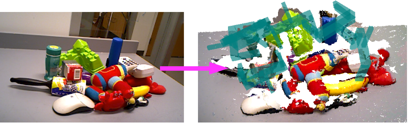
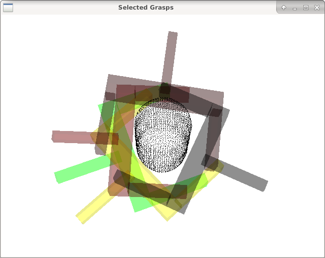

Branch currently contains WIP demo for Tiago robot and demos for Niryo arm.
For Fetch demo version please use the **fetch-demo** branch.
The **paper-devel** branch contains demo used for the paper.

---

# ICCLab fork

If you are using the robopaas/rosdocked-kinetic container (https://srv-lab-t-401.zhaw.ch/cloudrobotics/rosdocked), prerequisites for installing GDP are simpler.

Follow these steps:

1. Install tiago catkin workspace for kinetic and build it (https://wiki.ros.org/Robots/TIAGo/Tutorials/Installation/TiagoSimulation)

2. Source multiple workspaces (consider your own correct paths): 
	
		source ~/workspace/catkin_ws/devel/setup.bash
		source ~/workspace/tiago_public_ws/devel/setup.bash –extend

3. Clone this this project and build it in your catkin workspace

Once everything is built, you can run the Tiago pick&place demo


# How to start pick&place demo on summit_xl robot

First you need the icclab_turtlebot project installed and run the summit_xl robot simulation plus demo:

1. roslaunch icclab_turtlebot irlab_sim_summit_xls_complete.launch

2. ROS_NAMESPACE=summit_xl roslaunch robotnik_ur5_moveit_config demo.launch


Then you need to run the grasp generator and the python script in the gpd project:

3. roslaunch gpd grasp_generation.launch

4. python pick_and_place_summit_simulation.py 
	

Note that to make the scripts work with the namespace needed for the summit_xl robot some changes needed to be made in the pick_place_interface.py file which is found in /opt/ros/kinetic/lib/python2.7/dist-packages/moveit_python. In particular the constructor needs a new field that is to be passed during initialization of pick_action and place_action. See the code snippet below:

def __init__(self,
                 group="arm",
                 ee_group="gripper",
                 plan_only=False,
                 verbose=False,
                 ns=""):


        self._pick_action = actionlib.SimpleActionClient(ns+"pickup",
                                                         PickupAction)


        self._place_action = actionlib.SimpleActionClient(ns+"place",
                                                          PlaceAction)
                                                          
                                                          


To test the code, add an object in Gazebo in front of the robot. Move first the arm using RVIZ so that it is on top of the object. Make sure in Rviz the markers and grasps are activated. Then run the python script.                                                        

# How to start pick&place demo on Niryo arm


1. Install Intel® RealSense™ SDK 2.0 (https://github.com/IntelRealSense/librealsense)

2. Start the Niryo arm, calibrate it, setup the networking aking sure the arm can communicate with local laptop (http://wiki.ros.org/turtlebot/Tutorials/indigo/Network%20Configuration)

3. Find out transformations between camera and arm and modify the launch files
	

* run `roslaunch niryo_tutorial_onrobot.launch` from gpd/launch (for simulation use niryo_tutorial_simulation.launch)
* run `python pick_and_place_niryo_on_arm.py` from gpd/scripts (for simulation use pick_and_place_niryo_simulation.py)
* try out the 2 camera files for simulation and real arm operations

# How to start Tiago pick&place demo

* start roscore
* run `python gripper_hack.py` from gpd/scripts
* `roslaunch gpd tiago_playground.launch` (runs basic version of the demo, check another tiago_playground*.launch files)
* run `python pick_and_place.py` from gpd/scripts

# Using downsampled pointcloud:
* additionally run `downsample_cloud.py` script which aggregates 8 frames from `/xtion/depth_registered/points` topic, downsamples them and then publishes data on the `/xtion/depth_registered/points_downsampled` rostopic
* modify the pointcloud subscriber in the **22** LOC of `gpd_controller.py` to use the downsampled pointcloud topic
* `pick_and_place.py` - in **247** LOC set the `max_messages` argument to 1
* *TODO: Add option to pass the information about used version of the pointcloud to the script as an argument instead of modifying the code*

# Tricks:
* package tiago_gazebo starts **joystick_relay** node by default, which consumes a lot of CPU resources and is not used in the demo.
You can comment out **twist_mux** in `/tiago_gazebo/launch/simulation_tiago_bringup.launch`
* `perf.sh` script can be used for logging the CPU utilisation of multiple processes at once
* *cloud grasping* paper contains some useful information about the demo structure

# Grasp Pose Detection (GPD)

* **Author:** Andreas ten Pas (atp@ccs.neu.edu)
* **Version:** 1.0.0
* **Author's website:** [http://www.ccs.neu.edu/home/atp/](http://www.ccs.neu.edu/home/atp/)
* **License:** BSD


## 1) Overview

This package detects 6-DOF grasp poses for a 2-finger grasp (e.g. a parallel jaw gripper) in 3D point clouds.

**Note: This version does not require Caffe.**



Grasp pose detection consists of three steps: sampling a large number of grasp candidates, classifying these candidates 
as viable grasps or not, and clustering viable grasps which are geometrically similar.

The reference for this package is: [High precision grasp pose detection in dense clutter](http://arxiv.org/abs/1603.01564).

### UR5 Video

<a href="http://www.youtube.com/watch?feature=player_embedded&v=kfe5bNt35ZI
" target="_blank"></a>


## 2) Requirements

1. [PCL 1.7 or later](http://pointclouds.org/)
2. [Eigen 3.0 or later](https://eigen.tuxfamily.org)
3. <a href="http://wiki.ros.org/indigo" style="color:blue">ROS Indigo</a> <span style="color:blue">and Ubuntu 
14.04</span> *or* <a href="http://wiki.ros.org/kinetic" style="color:orange">ROS Kinetic</a> 
<span style="color:orange">and Ubuntu 16.04</span>


## 3) Prerequisites

The following instructions work for **Ubuntu 14.04** or **Ubuntu 16.04**. Similar instructions should work for other 
Linux distributions that support ROS.

1. Install ROS. In Ubuntu 14.04, install ROS Indigo [(Instructions)](http://wiki.ros.org/indigo/Installation/Ubuntu). 
In Ubuntu 16.04, install ROS Kinetic [(Instructions)](http://wiki.ros.org/kinetic/Installation/Ubuntu).

2. Clone the [grasp_pose_generator](https://github.com/atenpas/gpg) repository into some folder:

   ```
   cd <location_of_your_workspace>
   git clone https://github.com/atenpas/gpg.git
   ```

3. Build and install the *grasp_pose_generator*: 

   ```
   cd gpg
   mkdir build && cd build
   cmake ..
   make
   sudo make install
   ```


## 4) Compiling GPD

1. Clone this repository.
   
   ```
   cd <location_of_your_workspace/src>
   git clone https://github.com/atenpas/gpd.git
   ```

2. Make sure that you linked your local caffe build in CMakeLists.txt
   Something like:

   ```
   SET(CAFFE_DIR "/home/fitter/Documents/caffe/build")
   ```

3. Build your catkin workspace.

   ```
   cd <location_of_your_workspace>
   catkin_make
   ```


## 5) Generate Grasps for a Point Cloud File

Launch the grasp pose detection on an example point cloud:
   
   ```
   roslaunch gpd tutorial0.launch
   ```
Within the GUI that appears, press r to center the view, and q to quit the GUI and load the next visualization.
The output should look similar to the screenshot shown below.




## 6) Tutorials

1. [Detect Grasps With an RGBD camera](tutorials/tutorial_1_grasps_camera.md)
2. [Detect Grasps on a Specific Object](tutorials/tutorial_2_grasp_select.md)


## 7) Parameters

Brief explanations of parameters are given in *launch/classify_candidates_file_15_channels.launch* for using PCD files. 
For use on a robot, see *launch/ur5_15_channels.launch*. The two parameters that you typically want to play with to 
improve on then number of grasps found are *workspace* and *num_samples*. The first defines the volume of space in which 
to search for grasps as a cuboid of dimensions [minX, maxX, minY, maxY, minZ, maxZ], centered at the origin. The second 
is the number of samples that are drawn from the point cloud to detect grasps. You should set the workspace as small as 
possible and the number of samples as large as possible. 


## 8) Views


You can use this package with a single or with two depth sensors. The package comes with weight files for Caffe 
for both options. You can find these files in *gpd/caffe/15channels*. For a single sensor, use 
*single_view_15_channels.caffemodel* and for two depth sensors, use *two_views_15_channels_[angle]*. The *[angle]* is 
the angle between the two sensor views, as illustrated in the picture below. In the two-views setting, you want to 
register the two point clouds together before sending them to GPD.


To switch between one and two sensor views, change the parameter *trained_file* in the launch file 
*launch/caffe/ur5_15channels.launch*.


## 9) Input Channels for Neural Network

The package comes with weight files for two different input representations for the neural network that is used to 
decide if a grasp is viable or not: 3 or 15 channels. The default is 15 channels. However, you can use the 3 channels 
to achieve better runtime for a loss in grasp quality. For more details, please see the reference below.


## 10) Citation

If you like this package and use it in your own work, please cite our paper(s):

[1] Andreas ten Pas, Marcus Gualtieri, Kate Saenko, and Robert Platt. [**Grasp Pose Detection in Point 
Clouds**](http://arxiv.org/abs/1706.09911). The International Journal of Robotics Research, Vol 36, Issue 13-14, 
pp. 1455 - 1473. October 2017.

[2] Marcus Gualtieri, Andreas ten Pas, Kate Saenko, and Robert Platt. [**High precision grasp pose detection in dense 
clutter**](http://arxiv.org/abs/1603.01564). IROS 2016. 598-605.


## 11) Troubleshooting

* GCC 4.8: The package [might not compile](https://github.com/atenpas/gpd/issues/14#issuecomment-324789077) with 
GCC 4.8. This is due to [a bug](https://gcc.gnu.org/bugzilla/show_bug.cgi?id=58251) in GCC. **Solution:** Upgrade to 
GCC 4.9. 

* During `catkin_make`, you get this error: *[...]/caffe/include/caffe/util/cudnn.hpp:8:34: fatal error: caffe/proto/caffe.pb.h: No such file or directory*. **Solution ([source](https://github.com/muupan/dqn-in-the-caffe/issues/3)):**
    ```
    # In the directory you installed Caffe to
    protoc src/caffe/proto/caffe.proto --cpp_out=.
    mkdir include/caffe/proto
    mv src/caffe/proto/caffe.pb.h include/caffe/proto
    ```
